<!--
**iqlipx/iqlipx** is a ✨ _special_ ✨ repository because its `README.md` (this file) appears on your GitHub profile.

Here are some ideas to get you started:

- 🔭 I’m currently working on ...
- 🌱 I’m currently learning ...
- 👯 I’m looking to collaborate on ...
- 🤔 I’m looking for help with ...
- 💬 Ask me about ...
- 📫 How to reach me: ...
- 😄 Pronouns: ...
- ⚡ Fun fact: ...
-->
 
<h1 align="center">Hi 👋, I'm Iqlip</h1>
<h3 align="center">A passionate Cybersecurity Enthusiast</h3>

  

  

- 💬 Ask me about **Linux , Web , CTFs and Networking**

- 📫 How to reach me **https://iqlipx.github.io/Linktree**

<h3 align="left">Connect with me:</h3>

<h3 align="left">Languages and Tools:</h3>

         

